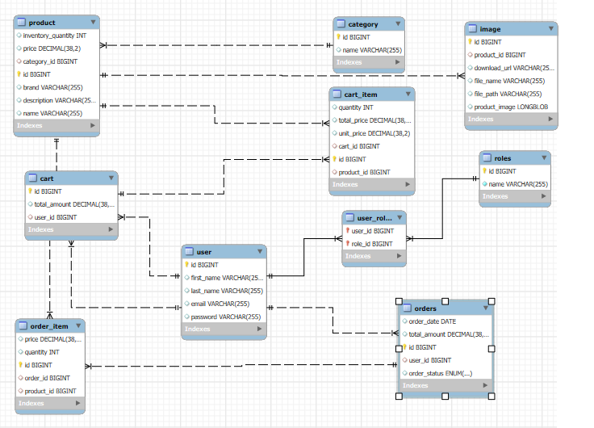

# Shopping Cart Application

## Overview
This is a backend application for managing a **Shopping Cart** system. It provides APIs for user authentication, managing products, roles, and orders. The application is secured with **JWT Authentication** and supports role-based access control.

---

## Features
- **User Management**: Registration, login, and role assignment.
- **Product Management**: CRUD operations for products.
- **Order Management**: Place, view, and manage orders.
- **JWT Authentication**: Secure endpoints with JSON Web Tokens.
- **Role-Based Access Control**: Limit actions based on user roles.

---

## Tech Stack
- **Language**: Java
- **Framework**: Spring Boot
- **Database**: MySQL
- **Security**: Spring Security with JWT
- **Build Tool**: Maven
- **Testing**: Postman for API testing
- **Documentation**: Swagger (optional)

---


### Installation
1. Clone the repository:
   ```bash
   git clone https://github.com/ranatarek-rt/shopping_cart.git
   cd shopping_cart

## Postman Collection

You can find a collection of all the API endpoints in this repository for testing the application:  
[Postman Collection](./shopping-cart.json)

### How to Use:
1. Download the `postman_collection.json` file from this repository.
2. Open Postman.
3. Click on the **Import** button (top left in Postman).
4. Select **File** and upload the `postman_collection.json` file.
5. Once imported, you can use the pre-configured endpoints to test the application.


## **Database Schema**
The database schema for this application is shown below:


